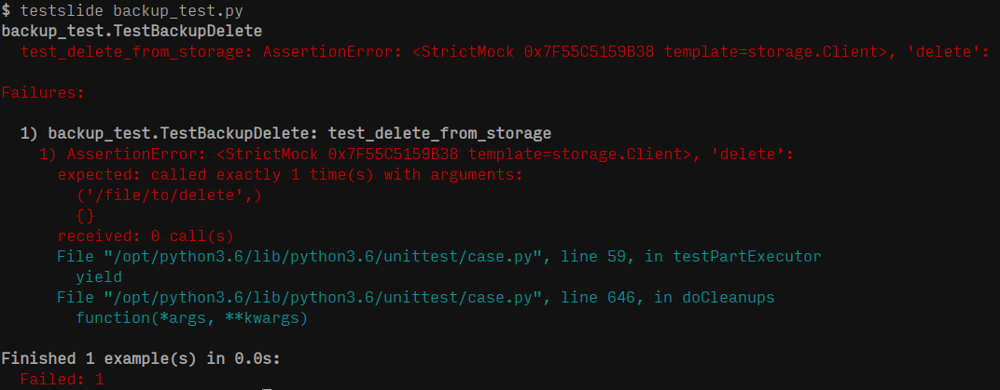
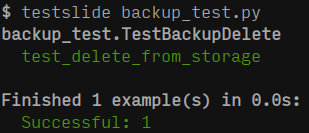

TestSlide
=========

A test framework for Python that enable `unit testing <https://docs.python.org/3/library/unittest.html>`_ / `TDD <https://en.wikipedia.org/wiki/Test-driven_development>`_/ `BDD <https://en.wikipedia.org/wiki/Behavior-driven_development>`_ to be productive and enjoyable.

Its well behaved mocks with thorough API validations catches bugs both when code is first written or long in the future when it is changed.

The flexibility of using them with existing ``unittest.TestCase`` or TestSlide's own test runner let users get its benefits without requiring refactoring existing code.

Quickstart
----------

Install the package:

.. code-block:: none

  pip install TestSlide

Scaffold the code you want to test ``backup.py``:

.. code-block:: python

  class Backup:
    def delete(self, path):
      pass

Write a test case ``backup_test.py`` describing the expected behavior:

.. code-block:: python

  import testslide, backup, storage

  class TestBackupDelete(testslide.TestCase):
    def setUp(self):
      super().setUp()
      self.storage_mock = testslide.StrictMock(storage.Client)
      # Makes storage.Client(timeout=60) return self.storage_mock
      self.mock_constructor(storage, 'Client')\
        .for_call(timeout=60)\
        .to_return_value(self.storage_mock)

    def test_delete_from_storage(self):
      # Set behavior and assertion for the call at the mock
      self.mock_callable(self.storage_mock, 'delete')\
        .for_call('/file/to/delete')\
        .to_return_value(True)\
        .and_assert_called_once()
      backup.Backup().delete('/file/to/delete')

TestSlide's :doc:`strict_mock/index` , :doc:`patching/mock_callable/index` and :doc:`patching/mock_constructor/index` are seamlessly integrated with Python's TestCase.

Run the test and see the failure:

TestSlide's mocks failure messages guide you towards the solution, that you can now implement:

.. code-block:: python

  import storage

  class Backup:
    def __init__(self):
      self.storage = storage.Client(timeout=60)

    def delete(self, path):
      self.storage.delete(path)

And watch the test go green:

It is all about letting the failure messages guide you towards the solution. There's a plethora of validation inside TestSlide's mocks, so you can trust they will help you iterate quickly when writing code and also cover you when breaking changes are introduced.

.. toctree::
   :maxdepth: 3
   :caption: Contents:

   test_runner/index.rst
   strict_mock/index.rst
   patching/index.rst
   testslide_dsl/index.rst
   code_snippets/index.rst
